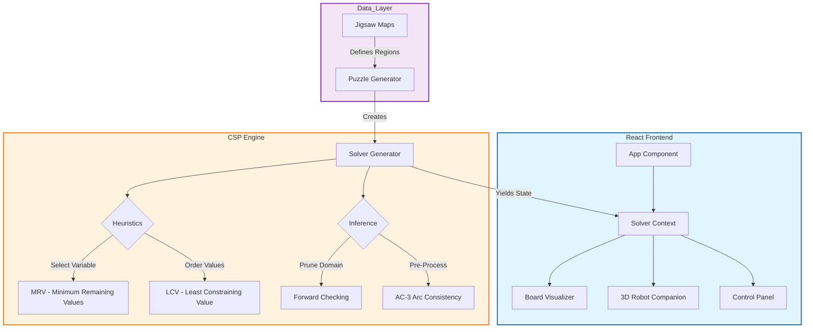

<!-- SEO: Primary Keywords included in the H1 and Hero image alt text -->
<div align="center">


<!-- Dynamic Typing SVG for Feature Highlights -->
<a href="https://amkhodaei83.github.io/csp-sudoku-visualizer">
  
</a>

<!-- Badges: Critical for Trust and Quick Info -->
<p align="center">
  <a href="https://github.com/Amkhodaei83/csp-sudoku-visualizer/blob/main/LICENSE">
    
  </a>
  <a href="https://react.dev">
    
  </a>
  <a href="https://threejs.org">
    
  </a>
  <a href="https://vitejs.dev">
    
  </a>

</p>

<!-- Action Buttons -->
<p align="center">
  <a href="https://amkhodaei83.github.io/csp-sudoku-visualizer">
    
  </a>
  <a href="#-getting-started">
    
  </a>
</p>

<br />

</div>

---

## 📑 Table of Contents
<details>
<summary><strong>Expand to view full navigation</strong></summary>

- [🤖 About The Project](#-about-the-project)
  - [Core Logic & Algorithms](#core-logic--algorithms)
  - [Tech Stack](#tech-stack)
- [🖼️ Demo & Visuals](#-demo--visuals)
- [🚀 Getting Started](#-getting-started)
- [🎮 Usage Guide](#-usage-guide)
- [📚 Algorithmic Reference](#-algorithmic-reference)
- [🛣️ Roadmap](#-roadmap)
- [🤝 Contributing](#-contributing)
- [📄 License](#-license)
- [📧 Contact](#-contact)

</details>

---

## 🤖 About The Project

**CSP Sudoku Visualizer** is a high-performance educational tool designed to demystify **Constraint Satisfaction Problems (CSP)** in Artificial Intelligence. Unlike standard Sudoku solvers that instantly output a result, this application renders the AI's "thought process" in real-time, visualizing how algorithms traverse the search space, prune dead ends, and backtrack from failures.

The project features a unique **3D Robot Companion** (built with React Three Fiber) that reacts emotionally to the algorithm's performance—celebrating solutions, getting frustrated by backtracks, or "thinking" during complex node expansions. This gamified approach makes complex AI concepts like **Arc Consistency** and **Heuristics** accessible and engaging.

### Core Logic & Algorithms

This repository implements a full suite of CSP techniques using JavaScript Generator Functions for step-by-step visualization:

| Algorithm / Heuristic | Function | Description |
| :--- | :--- | :--- |
| **Backtracking Search** | `DFS` | The fundamental recursive engine that explores the state space depth-first. |
| **AC-3** | `Constraint Propagation` | **Arc Consistency Algorithm #3**. A pre-processing step that prunes inconsistent values from domains before search begins, drastically reducing the search space. |
| **Forward Checking** | `Inference` | Proactively removes values from neighboring domains when a variable is assigned, detecting failures early. |
| **MRV** | `Variable Ordering` | **Minimum Remaining Values**. A "fail-first" heuristic that selects the variable with the fewest legal moves left to prune the tree faster. |
| **LCV** | `Value Ordering` | **Least Constraining Value**. A "fail-last" heuristic that prefers values that rule out the fewest choices for neighboring variables. |

### Tech Stack

This project is engineered with a modern, performance-focused stack:

| Component | Technology | Role |
| :--- | :--- | :--- |
| **Frontend Framework** |  | Component-based UI architecture. |
| **3D Engine** |  | Rendering the interactive 3D robot companion via `@react-three/fiber`. |
| **Build Tool** |  | Instant HMR and optimized production builds. |
| **Styling** |  | Custom Glassmorphism theme with `Framer Motion` for transitions. |
| **Icons** |  | Lightweight, consistent iconography. |
| **Algorithm Core** |  | Pure JS implementation of CSP logic using `function*` generators. |


---

## 🖼️ Demo & Visuals

Experience the **Constraint Satisfaction Problem (CSP)** solver in action. The live visualization demonstrates how heuristics like **MRV** (Minimum Remaining Values) and **Forward Checking** drastically reduce the search space compared to naive backtracking.

### 🎥 Live Preview

<div align="center">
  <a href="https://amkhodaei83.github.io/csp-sudoku-visualizer">
    
  </a>
  <p><em>(No installation required. Works on all modern browsers.)</em></p>
</div>


### 📸 Application Gallery

| **Jigsaw 6x6 Mode (Irregular Regions)** | **Standard 9x9 Mode (Advanced)** |
| :---: | :---: |
|  |  |
| *Solves complex "Squiggly" puzzles where regions are not perfect squares.* | *Includes difficulty generation and full AC-3 pre-processing.* |

### 🧠 Architecture Diagram

The application follows a clean separation between the React UI layer and the core CSP logic engine. The solver uses **JavaScript Generators** (`function*`) to `yield` state updates to the UI loop without blocking the main thread.



---

## 🚀 Getting Started

Follow these instructions to set up the project locally for development or contribution.

### Prerequisites

Ensure you have the following installed:
*   **Node.js** (v16.0.0 or higher)
*   **npm** (v7.0.0 or higher)
*   **Git**

### Installation

1.  **Clone the Repository**
    ```bash
    git clone https://github.com/Amkhodaei83/csp-sudoku-visualizer.git
    cd csp-sudoku-visualizer
    ```

2.  **Install Dependencies**
    ```bash
    npm install
    ```

3.  **Start the Development Server**
    ```bash
    npm run dev
    ```
    > The application will launch at `http://localhost:5173`.

4.  **Build for Production**
    ```bash
    npm run build
    ```
    > The optimized build will be output to the `dist/` folder, ready for deployment.

### Environment Variables

No `.env` file is required for standard local development. The project is fully client-side.

---

## 🎮 Usage Guide

The interface is designed for experimentation. Toggle different heuristics to observe their impact on the solver's efficiency (measured in **Nodes Expanded** and **Backtracks**).

### 1. Select a Mode
*   **Homework (6x6 Jigsaw):** Solves irregular Sudoku puzzles where regions are custom shapes (Snake, Steps, etc.). Perfect for visualizing constraint complexity.
*   **Advanced (9x9 Standard):** Classic Sudoku with a difficulty slider. Test the limits of the backtracking engine on "Expert" puzzles.

### 2. Configure Heuristics
Before starting the solver, toggle the following options in the **Control Panel**:

*   **MRV (Minimum Remaining Values):**
    *   *Effect:* Selects the cell with the fewest legal moves left.
    *   *Best For:* Reducing the branching factor of the search tree.
*   **LCV (Least Constraining Value):**
    *   *Effect:* Tries values that leave the most options open for neighbors.
    *   *Best For:* Finding a solution faster in loose constraint graphs (can be slow on 9x9 due to overhead).
*   **Forward Checking:**
    *   *Effect:* Prunes the domain of neighbors immediately after assignment.
    *   *Best For:* Detecting dead-ends early (fail-fast).

### 3. Run AC-3 Pre-Processing
Click the **⚡ Run AC-3** button *before* starting the search. This runs the **Arc Consistency Algorithm #3** to propagate constraints and eliminate impossible values from domains globally.
> **Pro Tip:** On hard puzzles, running AC-3 first can solve 20-50% of the board instantly without any guessing.

### 4. Control the Visualization
*   **Play/Pause:** Start or stop the solver.
*   **Step Forward/Back:** Analyze the algorithm frame-by-frame.
*   **Speed Slider:** Adjust the visualization speed from "Detailed Analysis" to "Instant Solve".

---

## 📚 Algorithmic Reference

This project visualizes sophisticated AI concepts. Below is a detailed breakdown of the internal logic for developers and students.

<details>
<summary><strong>1. CSP Model (Variables, Domains, Constraints)</strong></summary>

The Sudoku board is modeled as a **Constraint Satisfaction Problem (CSP)**:
- **Variables ($X$):** The empty cells on the board (36 for 6x6, 81 for 9x9).
- **Domains ($D$):** The set of possible values for each variable (e.g., $\{1, 2, ..., 9\}$).
- **Constraints ($C$):**
  - **All-Diff Row:** No two cells in the same row can share a value.
  - **All-Diff Column:** No two cells in the same column can share a value.
  - **All-Diff Region:** No two cells in the same "Region" (3x3 Box or Irregular Jigsaw Shape) can share a value.

The solver builds a **Constraint Graph** where nodes are variables and edges represent constraints between them.
</details>

<details>
<summary><strong>2. Backtracking Search & Heuristics</strong></summary>

The core engine uses **Recursive Backtracking** enhanced by heuristics:

- **MRV (Minimum Remaining Values):** Instead of picking the first empty cell, we pick the cell with the smallest domain size $|D_i|$.
  > *Why?* This heuristic implements the "Fail-First" principle. By picking the most constrained variable, we detect dead-ends earlier in the search tree.

- **LCV (Least Constraining Value):** When assigning a value $v$ to variable $X$, we choose the value that rules out the *fewest* choices for neighboring variables in the constraint graph.
  > *Why?* This heuristic implements the "Fail-Last" principle. We want to maximize the chances of finding a solution without backtracking.

- **Forward Checking:** Whenever variable $X$ is assigned value $v$, we look ahead at all unassigned neighbors $Y$ connected to $X$ by a constraint. We remove $v$ from $D_Y$. If $D_Y$ becomes empty, we backtrack immediately.
</details>

<details>
<summary><strong>3. AC-3 Arc Consistency</strong></summary>

The **AC-3 Algorithm** makes the entire CSP arc-consistent before search begins.
- A variable $X_i$ is arc-consistent with respect to another variable $X_j$ if for every value in $D_i$, there is some value in $D_j$ that satisfies the binary constraint.
- **Queue-Based Propagation:**
  1. Initialize a queue with all arcs $(X_i, X_j)$ in the constraint graph.
  2. While the queue is not empty, pop an arc $(X_i, X_j)$.
  3. **Revise($X_i, X_j$):** Remove values from $D_i$ that have no consistent match in $D_j$.
  4. If $D_i$ was modified, add all neighbors of $X_i$ back to the queue to propagate the change.
</details>

---

## 🛣️ Roadmap

The project is feature-complete for the core CSP assignment, but we have exciting plans for future enhancements:

- [x] **Jigsaw 6x6 Solver** (Irregular Regions)
- [x] **Standard 9x9 Solver** (Advanced Mode)
- [x] **AC-3 Pre-Processing**
- [x] **MRV & LCV Heuristics**
- [x] **Interactive 3D Robot Companion**
- [ ] **Degree Heuristic:** Prioritize variables involved in the largest number of constraints.
- [ ] **Simulated Annealing:** Implement local search as an alternative to backtracking.
- [ ] **Min-Conflicts Algorithm:** A heuristic for solving CSPs by iteratively minimizing conflicts.
- [ ] **PWA Support:** Make the visualizer installable as a progressive web app.

---

## 🤝 Contributing

Contributions are welcome! Whether you're fixing a bug, improving the heuristics, or adding new puzzle types (like Killer Sudoku), we'd love your help.

1.  **Fork the Project**
2.  **Create your Feature Branch** (`git checkout -b feature/AmazingFeature`)
3.  **Commit your Changes** (`git commit -m 'Add some AmazingFeature'`)
4.  **Push to the Branch** (`git push origin feature/AmazingFeature`)
5.  **Open a Pull Request**

Please ensure your code follows the existing style guide (ESLint configuration included).

---

## 📄 License

This project is licensed under the **MIT License** - see the [LICENSE](LICENSE) file for details.

---

## 📧 Contact & Acknowledgments

**Project Lead:** Amir Hossein Khodaei ([@Amkhodaei83](https://github.com/Amkhodaei83))

<a href="https://github.com/Amkhodaei83">
  
</a>
<a href="mailto:amkhodaei83@gmail.com">
  
</a>

### Acknowledgments

This project stands on the shoulders of giants. Special thanks to the open-source community:

*   **[React Three Fiber](https://docs.pmnd.rs/react-three-fiber):** For making 3D in React accessible and performant.
*   **[Canvas Confetti](https://www.npmjs.com/package/canvas-confetti):** For the celebration effects.
*   **[Lucide React](https://lucide.dev):** For the beautiful, lightweight icons.
*   **[Vite](https://vitejs.dev):** For the lightning-fast development experience.
*   **University AI Coursework:** Inspired by the classical **Constraint Satisfaction Problem (CSP)** curriculum.

<br />
<div align="center">
  
</div>
