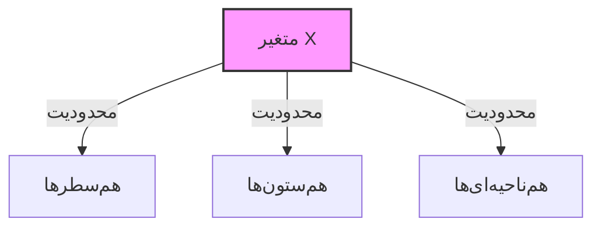

# گزارش پروژه: حل سودوکوی ۶×۶ نامتقارن با روش‌های ارضای محدودیت

## ۱. خلاصه و معرفی
در این تکلیف، مسئله سودوکوی ۶×۶ با نواحی نامتقارن (جورچینی) را با استفاده از روش‌های «مسئله ارضای محدودیت» (CSP) مدل‌سازی و حل کردم. هدف اصلی پروژه، پیاده‌سازی الگوریتم‌های جستجو شامل عقب‌گرد (Backtracking)، انتخاب هوشمندانه متغیر (MRV)، مرتب‌سازی مقادیر (LCV)، بررسی روبه‌جلو (Forward Checking) و سازگاری کمان‌ها (AC-3) است.

برای درک بهتر نحوه کارکرد این الگوریتم‌ها و مشاهده رفتار آن‌ها در زمان اجرا، پروژه را به جای یک اسکریپت ساده متنی، به صورت یک برنامه گرافیکی تحت وب با استفاده از کتابخانه ری‌اکت (React) نوشتم. این رویکرد اجازه می‌دهد تا مراحل جستجو، پر شدن خانه‌ها و بازگشت‌ها را به صورت زنده ببینیم و آمار دقیق (تعداد گره‌ها و بازگشت‌ها) را در لحظه مشاهده کنیم.

**لینک‌های پروژه:**
کد منبع و فایل‌های پروژه در مخزن زیر قابل دسترسی است:
*   [گیت‌هاب پروژه (Source Code)](https://github.com/Amkhodaei83/csp-sudoku-visualizer)

برای مشاهده و تست عملکرد برنامه بدون نیاز به نصب، می‌توانید از لینک زیر استفاده کنید:
*   [اجرای آنلاین (Live Demo)](https://amkhodaei83.github.io/csp-sudoku-visualizer)

| **Jigsaw 6x6 Mode** | **Standard 9x9 Mode** |
|:---:|:---:|
|  |  |


## ۲. مدل‌سازی مسئله (تعریف CSP)

برای اینکه کامپیوتر بتواند سودوکو را حل کند، ابتدا مسئله را به فرم استاندارد CSP (مسئله ارضای محدودیت) تبدیل کردم. در این مدل، سه جزء اصلی داریم: متغیرها، دامنه‌ها و محدودیت‌ها.

### ۲.۱. متغیرها (Variables)
در یک جدول ۶×۶، دقیقاً ۳۶ خانه داریم. هر خانه را به عنوان یک متغیر $X$ در نظر گرفتم.
*   **تعداد متغیرها:** ۳۶ عدد ($X_0$ تا $X_{35}$)
*   **نمایش:** هر متغیر با مختصات (سطر، ستون) مشخص می‌شود. مثلاً متغیر سطر اول و ستون اول برابر است با $R1C1$.

### ۲.۲. دامنه‌ها (Domains)
دامنه، شامل مقادیر مجازی است که می‌توانیم در هر خانه قرار دهیم.
*   برای خانه‌های خالی، دامنه اولیه برابر است با: $\{1, 2, 3, 4, 5, 6\}$
*   برای خانه‌هایی که از ابتدا مقدار دارند (خانه‌های ثابت)، دامنه فقط شامل همان عدد است (مثلاً $\{3\}$).

### ۲.۳. محدودیت‌ها (Constraints)
قوانین بازی تعیین می‌کنند که چه اعدادی نمی‌توانند کنار هم قرار بگیرند. در این پروژه دو دسته محدودیت داریم:

**الف) محدودیت‌های سطری و ستونی (دودویی):**
هر متغیر با تمام متغیرهای هم‌سطر و هم‌ستون خود رابطه دارد و نباید مقدار یکسان داشته باشند.
*   محدودیت سطرها (All-Diff Row)
*   محدودیت ستون‌ها (All-Diff Column)

**ب) محدودیت‌های نواحی نامتقارن (Jigsaw Constraints):**
تفاوت اصلی این پروژه با سودوکوی معمولی در همین بخش است. به جای مربع‌های ۳×۲، جدول به ۶ ناحیه نامتقارن یا متقارن تقسیم شده است که به صورت رندوم ساخته میشوند.

در پیاده‌سازی، من یک گراف همسایگی (Constraint Graph) ساختم. هر متغیر با تمام متغیرهایی که در سطر، ستون یا ناحیه خودش هستند، «همسایه» می‌شود و هنگام مقداردهی، فقط کافیست همسایه‌های آن متغیر را چک کنیم.



### ۲.۴. توسعه اختیاری: حالت پیشرفته (سودوکوی استاندارد ۹×۹)
علاوه بر خواسته اصلی پروژه (سودوکوی ۶×۶)، من موتور حل‌کننده (CSP Engine) را به گونه‌ای طراحی کردم که "عمومی" (Generic) باشد. به عنوان یک ویژگی امتیازی، قابلیت حل **سودوکوی کلاسیک ۹×۹** را نیز به برنامه اضافه کردم.

تفاوت اصلی در مدل‌سازی این بخش عبارت است از:
*   **تعداد متغیرها:** ۸۱ متغیر (در مقابل ۳۶ متغیر حالت قبل).
*   **دامنه‌ها:** اعداد ۱ تا ۹.
*   **محدودیت‌ها:** علاوه بر سطر و ستون، محدودیت نواحی به صورت **مربع‌های استاندارد ۳×۳** تعریف شده است.

این بخش نشان می‌دهد که الگوریتم‌های پیاده‌سازی شده (MRV و Forward Checking) نه تنها روی ۶×۶، بلکه روی فضای حالت بسیار بزرگتر (۹×۹) نیز با کارایی بالا عمل می‌کنند. شما می‌توانید در صفحه `AdvancedPage` این قابلیت را مشاهده کنید.

## ۳. رابط کاربری و مشاهده فرآیند حل

برای اینکه بتوانم رفتار الگوریتم‌ها را دقیق بررسی کنم، یک محیط گرافیکی طراحی کردم. در تصویری که از برنامه مشاهده می‌کنید، بخش‌های مختلفی وجود دارد که هر کدام وظیفه خاصی دارند:

### ۳.۱. پنل تولید پازل (Generator Panel)
در بالای صفحه (کادر بنفش تیره)، کنترل‌های مربوط به ساخت مسئله قرار دارد:
*   **نوار سختی (Difficulty Slider):** این نوار لغزنده که روی ۵۰٪ تنظیم شده، تعیین می‌کند چه تعداد از خانه‌های جدول خالی باشند. هر چه درصد بالاتر باشد، خانه‌های خالی بیشتر و حل مسئله سخت‌تر می‌شود.
*   **دکمه تولید جدید (Generate New):** با زدن این دکمه، الگوریتم تولیدکننده اجرا شده و یک جدول معتبر جدید می‌سازد.
*   **شمارنده‌های آمار (Metrics):** در سمت راست بالا، دو عدد مهم نمایش داده می‌شود:
    *   **Nodes:** تعداد کل گره‌هایی که الگوریتم تاکنون بررسی کرده است (Expands).
    *   **Backtracks:** تعداد دفعاتی که الگوریتم به بن‌بست خورده و مجبور به عقب‌گرد شده است. این عدد معیار اصلی برای مقایسه کارایی روش‌هاست.

### ۳.۲. پنل تنظیمات الگوریتم (Configuration)
در کادر پایینی، می‌توانیم هوش مصنوعی را قبل یا حین حل مسئله تنظیم کنیم:
*   **تیک‌های انتخاب روش (Checkboxes):**
    *   **MRV:** اگر فعال باشد، الگوریتم ابتدا سراغ خانه‌ای می‌رود که کمترین گزینه ممکن را دارد (انتخاب هوشمند متغیر).
    *   **LCV:** اگر فعال باشد، مقادیر را طوری مرتب می‌کند که کمترین محدودیت برای همسایه‌ها ایجاد شود (انتخاب هوشمند مقدار).
    *   **Forward Check:** با فعال کردن این گزینه، پس از هر انتخاب، دامنه همسایه‌ها بررسی و هرس می‌شود تا از بن‌بست‌های زودرس جلوگیری شود.
*   **دکمه Run AC-3:** این دکمه الگوریتم سازگاری کمان (Arc Consistency) را به صورت مجزا اجرا می‌کند. با زدن آن، قبل از شروع جستجو، دامنه‌های ناسازگار حذف می‌شوند که تاثیر زیادی در ساده‌سازی حل دارد.

### ۳.۳. کنترل‌های اجرا (Playback Controls)
پایین‌ترین بخش برای کنترل زمان در نظر گرفته شده است:
*   **دکمه‌های پخش:** دکمه وسط (Play/Pause) فرآیند حل را شروع یا متوقف می‌کند. دکمه‌های چپ و راست (Step) اجازه می‌دهند الگوریتم را مرحله به مرحله (Frame by Frame) جلو یا عقب ببریم تا دقیقاً بفهمیم در هر لحظه چه اتفاقی می‌افتد.
*   **دکمه بازنشانی (Reset):** (سمت چپ، قرمز رنگ) کل جدول و دامنه‌ها را به حالت اولیه برمی‌گرداند.
*   **سرعت (Speed):** سرعت انیمیشن حل را تعیین می‌کند تا بتوانیم فرآیند را سریع‌تر یا دقیق‌تر ببینیم.

## ۴. پیاده‌سازی الگوریتم‌ها و منطق برنامه

در این بخش توضیح می‌دهم که هر قسمت از پروژه چطور کدنویسی شده است. تمام منطق‌های هوش مصنوعی در پوشه `src/algorithms` قرار دارند تا از کدهای رابط کاربری جدا باشند.

### ۴.۱. تولید پازل (Puzzle Generation)
**مفهوم:** برای اینکه بتوانم الگوریتم را تست کنم، نیاز به پازل‌های معتبر داشتم. تولید تصادفی اعداد معمولاً به بن‌بست می‌خورد، پس از روش معکوس استفاده کردم.
**منطق کد:**
۱. ابتدا یک جدول خالی ایجاد می‌کنم.
۲. با استفاده از یک تابع بازگشتی (مشابه حل‌کننده)، جدول را کاملاً پر می‌کنم تا یک حالت "برنده" ساخته شود.
۳. سپس بر اساس "درصد سختی"، تعدادی از خانه‌ها را به صورت تصادفی پاک (صفر) می‌کنم تا تبدیل به معما شود.

**پیش‌نمایش کد (`JigsawGenerator.js`):**
```javascript
export const generateJigsawPuzzle = (mapArray, difficulty = 0.5) => {
    // 1. Create Empty Board & Fill it with a valid solution
    let solvedBoard = new Array(36).fill(0);
    fillBoard(solvedBoard, mapArray);

    // 2. Remove numbers based on difficulty
    let puzzle = [...solvedBoard];
    const cellsToRemove = Math.floor(10 + (difficulty * 15)); 
    
    for(let i=0; i<cellsToRemove; i++) {
        let idx = Math.floor(Math.random() * 36);
        puzzle[idx] = 0; // Dig a hole
    }
    return puzzle;
};
```
🔗 [مشاهده فایل کامل: src/algorithms/JigsawGenerator.js](https://github.com/Amkhodaei83/csp-sudoku-visualizer/blob/main/src/algorithms/JigsawGenerator.js)

---

### ۴.۲. کلاس CSP و گراف محدودیت (Board Logic)
**مفهوم:** قبل از حل، باید مسئله را تعریف کنیم. کلاس CSP مسئول نگهداری وضعیت برد، دامنه‌ها و از همه مهم‌تر "همسایه‌ها" است.
**منطق کد:**
در متد `_buildConstraintGraph`، برای هر خانه ۳۶ بار حلقه می‌زنم و چک می‌کنم آیا خانه دیگر در همان سطر، ستون یا ناحیه (Region) هست یا نه. اگر بود، آن را به لیست همسایه‌های آن خانه اضافه می‌کنم. این کار باعث می‌شود در زمان جستجو، دسترسی به محدودیت‌ها بسیار سریع (O(1)) باشد.

**پیش‌نمایش کد (`CSP.js`):**
```javascript
_buildConstraintGraph() {
    for (let i = 0; i < this.totalCells; i++) {
        const myNeighbors = new Set();
        // ... logic to find row, col, region ...
        if (isRow || isCol || isRegion) {
            myNeighbors.add(j);
        }
        this.neighbors[i] = Array.from(myNeighbors);
    }
}
```
🔗 [مشاهده فایل کامل: src/algorithms/CSP.js](https://github.com/Amkhodaei83/csp-sudoku-visualizer/blob/main/src/algorithms/CSP.js)

---

### ۴.۳. جستجوی عقب‌گرد (Backtracking Search)
**مفهوم:** این موتور اصلی حل مسئله است. از روش جستجوی عمق‌اول (DFS) استفاده می‌کند.
**منطق کد:**
من از `function*` (Generator) در جاوااسکریپت استفاده کردم. این ویژگی اجازه می‌دهد تابع را وسط اجرا متوقف (pause) کنم و وضعیت فعلی را به رابط کاربری بفرستم (`yield`) تا کاربر ببیند چه اتفاقی افتاده، و سپس دوباره ادامه دهم.
اگر به بن‌بست بخورم، مقدار خانه را صفر می‌کنم (Backtrack) و عدد بعدی را امتحان می‌کنم.

**پیش‌نمایش کد (`Solver.js`):**
```javascript
function* backtrack(depth = 0) {
    // Base Case: Is board full?
    if (csp.board.every(cell => cell !== 0)) return true;

    const varIndex = selectNextVariable(csp, options); // Select Var
    const sortedValues = orderDomainValues(csp, varIndex, options); // Order Values

    for (const value of sortedValues) {
        if (csp.isConsistent(varIndex, value)) {
            csp.board[varIndex] = value; // Assign
            yield { type: 'STEP', ... }; // Visualize assignment

            if (yield* backtrack(depth + 1)) return true; // Recurse

            csp.board[varIndex] = 0; // Backtrack (Undo)
            yield { type: 'BACKTRACK', ... }; // Visualize undo
        }
    }
    return false;
}
```
🔗 [مشاهده فایل کامل: src/algorithms/Solver.js](https://github.com/Amkhodaei83/csp-sudoku-visualizer/blob/main/src/algorithms/Solver.js)

---

### ۴.۴. انتخاب متغیر MRV (Minimum Remaining Values)
**مفهوم:** به جای انتخاب اولین خانه خالی، خانه‌ای را انتخاب می‌کنیم که کمترین گزینه (کوچکترین دامنه) را دارد. این کار باعث می‌شود اگر قرار است به بن‌بست بخوریم، خیلی زودتر این اتفاق بیفتد (Fail-First).
**منطق کد:**
بین تمام خانه‌های خالی می‌گردم و طول آرایه `domain` آن‌ها را چک می‌کنم. اندیس خانه‌ای که کمترین طول را دارد برمی‌گردانم.

**پیش‌نمایش کد (`Heuristics.js`):**
```javascript
export const selectNextVariable = (csp, strategy) => {
    if (strategy === 'MRV') {
        let bestVar = -1;
        let minSize = Infinity;
        for (let i = 0; i < csp.totalCells; i++) {
            if (csp.board[i] === 0 && csp.domains[i].length < minSize) {
                minSize = csp.domains[i].length;
                bestVar = i;
            }
        }
        return bestVar;
    }
    // ... default to FIRST_EMPTY
};
```
🔗 [مشاهده فایل کامل: src/algorithms/Heuristics.js](https://github.com/Amkhodaei83/csp-sudoku-visualizer/blob/main/src/algorithms/Heuristics.js)

---

### ۴.۵. انتخاب مقدار LCV (Least Constraining Value)
**مفهوم:** وقتی می‌خواهیم عددی را در خانه بگذاریم، عددی را اول تست می‌کنیم که دست همسایه‌ها را کمتر ببندد (Fail-Last).
**منطق کد:**
برای هر عدد ممکن در دامنه، می‌شمارم که اگر این عدد را انتخاب کنم، چند تا از گزینه‌های همسایه‌ها حذف می‌شود. سپس اعداد را بر اساس این "تعداد حذف" به صورت صعودی مرتب می‌کنم.

**پیش‌نمایش کد (`Heuristics.js`):**
```javascript
export const orderDomainValues = (csp, varIndex, strategy) => {
    const values = [...csp.domains[varIndex]];
    if (strategy === 'LCV') {
        return values.sort((valA, valB) => {
            // Count how many neighbors lose an option for valA vs valB
            return countConstraints(csp, varIndex, valA) - countConstraints(csp, varIndex, valB); 
        });
    }
    return values; // Default: Ascending (1, 2, 3...)
};
```
🔗 [مشاهده فایل کامل: src/algorithms/Heuristics.js](https://github.com/Amkhodaei83/csp-sudoku-visualizer/blob/main/src/algorithms/Heuristics.js)

---

### ۴.۶. بررسی رو‌به‌جلو (Forward Checking)
**مفهوم:** وقتی عددی را در خانه‌ای قرار می‌دهیم، بلافاصله آن عدد را از دامنه تمام همسایه‌ها حذف می‌کنیم. اگر دامنه همسایه‌ای خالی شد، یعنی این مسیر غلط است و فوراً عقب‌گرد می‌کنیم.
**منطق کد:**
متد `pruneNeighbors` مقادیر ناسازگار را از دامنه‌ها حذف می‌کند و لیست حذفیات را نگه می‌دارد. اگر جستجو شکست خورد، با متد `restorePruned` دامنه‌ها را به حالت قبل برمی‌گردانیم.

**پیش‌نمایش کد (`CSP.js`):**
```javascript
pruneNeighbors(varIndex, value) {
    const pruned = {}; 
    for (const neighbor of this.neighbors[varIndex]) {
        if (domain.includes(value)) {
            // Remove value from neighbor's domain
            this.domains[neighbor] = domain.filter(v => v !== value);
            // Save for restoration later
            pruned[neighbor].push(value); 
            
            if (this.domains[neighbor].length === 0) return { success: false, pruned };
        }
    }
    return { success: true, pruned };
}
```
🔗 [مشاهده فایل کامل: src/algorithms/CSP.js](https://github.com/Amkhodaei83/csp-sudoku-visualizer/blob/main/src/algorithms/CSP.js)

---

### ۴.۷. سازگاری کمان (Run AC-3)
**مفهوم:** این الگوریتم قبل از شروع جستجو اجرا می‌شود تا دامنه‌ها را پاک‌سازی کند.
**منطق کد:**
یک صف از تمام کمان‌ها (جفت همسایه‌ها) می‌سازیم. هر بار چک می‌کنیم آیا مقداری در $X_i$ هست که هیچ معادلی در $X_j$ نداشته باشد؟ اگر بود، حذفش می‌کنیم و همسایه‌های $X_i$ را دوباره به صف اضافه می‌کنیم چون ممکن است محدودیت جدیدی ایجاد شده باشد.

**پیش‌نمایش کد (`AC3.js`):**
```javascript
export function* ac3Generator(csp) {
    let queue = [/* All Arcs */];
    while (queue.length > 0) {
        const [xi, xj] = queue.shift();
        if (revise(csp, xi, xj)) {
            if (csp.domains[xi].length === 0) return false; // Impossible puzzle
            // Add neighbors back to queue
            yield { type: 'AC3_PRUNE', activeCell: xi };
        }
    }
}
```
🔗 [مشاهده فایل کامل: src/algorithms/AC3.js](https://github.com/Amkhodaei83/csp-sudoku-visualizer/blob/main/src/algorithms/AC3.js)

## ۵. تحلیل کارایی الگوریتم‌ها

در این پروژه، چون امکان مشاهده زنده روند حل وجود داشت، توانستم تاثیر هر الگوریتم را به وضوح ببینم. هرچند داده‌های دقیق عددی به سخت‌افزار و مرورگر بستگی دارد، اما نتایج کیفی زیر کاملاً مشهود بود:

**۱. تاثیر MRV (انتخاب متغیر):**
بدون MRV، الگوریتم به صورت خطی (سطر به سطر) جلو می‌رود. در پازل‌های سخت، این کار باعث می‌شود الگوریتم در همان سطرهای اول گیر کند و هزاران بار عقب‌گرد کند.
اما با فعال کردن MRV، الگوریتم فوراً به سراغ خانه‌هایی می‌رود که "فقط ۱ یا ۲ گزینه" دارند. این کار باعث می‌شود درخت جستجو بسیار باریک‌تر شود و تعداد عقب‌گردها (Backtracks) به شدت کاهش یابد. عملاً MRV بیشترین تاثیر را در حل پازل‌های دشوار داشت.

**۲. تاثیر LCV (انتخاب مقدار):**
این روش سربار محاسباتی دارد (چون باید مقادیر را مرتب کند). در پازل‌های ساده، گاهی باعث کند شدن روند می‌شود. اما در پازل‌های خیلی پیچیده، LCV کمک می‌کند که الگوریتم در اولین تلاش‌ها، اعدادی را انتخاب کند که منجر به بن‌بست نمی‌شوند. در واقع LCV تعداد عقب‌گردها را کم می‌کند، اما لزوماً زمان اجرا را در پازل‌های کوچک کاهش نمی‌دهد.

**۳. تاثیر Forward Checking:**
این روش بسیار موثر بود. بدون آن، الگوریتم ممکن است ۱۰ مرحله جلو برود در حالی که در مرحله ۵، یک خانه دامنه‌اش خالی شده و ما خبر نداریم.
با فعال کردن Forward Checking، الگوریتم به محض اینکه می‌بیند یک انتخاب باعث خالی شدن دامنه همسایه‌ای می‌شود، همان‌جا متوقف می‌شود (Prune) و مسیر غلط را ادامه نمی‌دهد. این کار "عمق شکست" را به شدت کاهش می‌دهد.

**۴. تاثیر AC-3:**
اجرای AC-3 قبل از شروع جستجو، مانند تمیزکاری اولیه است. در بسیاری از تست‌ها دیدم که AC-3 توانست تعداد زیادی از خانه‌ها را قبل از اینکه حتی جستجو شروع شود، حل کند (خانه‌هایی که فقط یک کاندیدا داشتند). این کار باعث می‌شود فضای حالت اولیه بسیار کوچکتر شود.

---

## ۶. نتیجه‌گیری

این پروژه نشان داد که حل مسائل CSP صرفاً به قدرت پردازش بستگی ندارد، بلکه "هوشمندانه عمل کردن" مهم‌تر است.
استفاده از عقب‌گرد ساده (Backtracking) برای سودوکوهای کوچک جواب می‌دهد، اما با بزرگ شدن ابعاد یا پیچیده شدن محدودیت‌ها (مثل نواحی نامتقارن)، بدون هیوریستیک‌هایی مثل MRV و Forward Checking عملاً حل مسئله غیرممکن یا بسیار زمان‌بر می‌شود.

پیاده‌سازی این پروژه به صورت بصری و تعاملی به من کمک کرد تا دقیقاً درک کنم چرا و کجا الگوریتم گیر می‌کند و چطور Forward Checking می‌تواند شاخه‌های اضافی درخت جستجو را هرس کند. تمام اهداف خواسته شده در تمرین (مدل‌سازی، پیاده‌سازی هیوریستیک‌ها و تحلیل) در این پروژه پوشش داده شد.

---

## ۷. ضمائم (فایل‌ها)

لیست فایل‌های اصلی پروژه که در پوشه تحویلی قرار دارند:

1.  `HomeworkPage.js`: صفحه اصلی حل تمرین (سودوکوی ۶×۶ نامتقارن).
2.  `AdvancedPage.js`: بخش امتیازی (تولیدکننده سودوکوی ۹×۹ استاندارد).
3.  `algorithms/CSP.js`: کلاس مدل‌سازی مسئله.
4.  `algorithms/Solver.js`: موتور جستجوی Backtracking.
5.  `algorithms/Heuristics.js`: کدهای مربوط به MRV و LCV.
6.  `algorithms/AC3.js`: پیاده‌سازی الگوریتم سازگاری کمان.
7.  `data/jigsawMaps.js`: تعریف مختصات نواحی ۶گانه نامتقارن.

